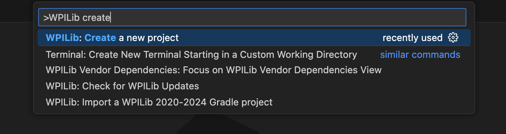
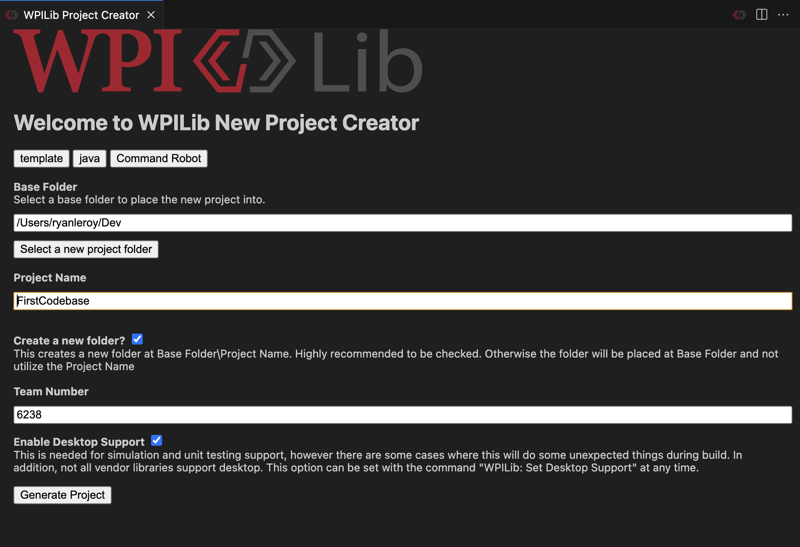

# First Steps with WPILib

## **Creating your first project**
Its time to create your first ever FRC codebase! To start type ++ctrl+shift+p++ on windows or ++cmd+shift+p++ on MacOS. This opens the command pallette which will be a super useful tool going forward. Once its open type in ```WPILib create``` and press ++enter++. This will open the project creation screen.

<figure markdown="span">
    
  <figcaption>The Command Palette</figcaption>
</figure>

Now at the top of the project creation screen click the select project type button. Choose Template -> java -> Command Robot. Then select the base folder where it will put the new robot project folder in. Add a project name and team number. Finally check the enable desktop support button and generate the project.

<figure markdown="span">
    
  <figcaption>Your project creation page should look roughly similar to this</figcaption>
</figure>

## **Building and Deploying**
To build and deploy our code to a robot relies on the command pallette. Open the command pallette and type ```WPILib deploy``` and press ++enter++ to deploy. Do the same but with ```WPILib build``` if you just want to build the code and not deploy.

When you run deploy wpilib will check to see if a robot is connected via the radio. If not, it will error.
Both build and deploy will open a terminal at the bottom of your screen allowing you to see if any errors occur during the build process. These could be formatting errors, gradle errors, or just simple compilation errors.