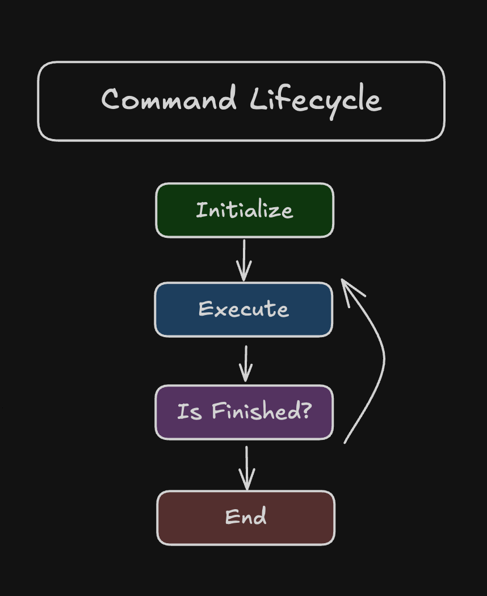
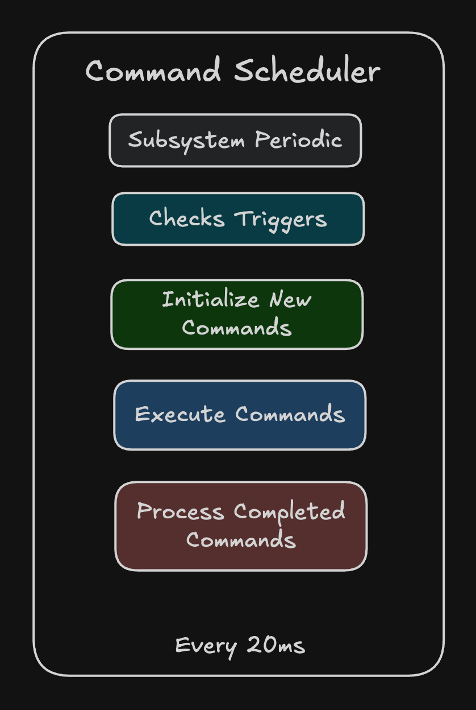
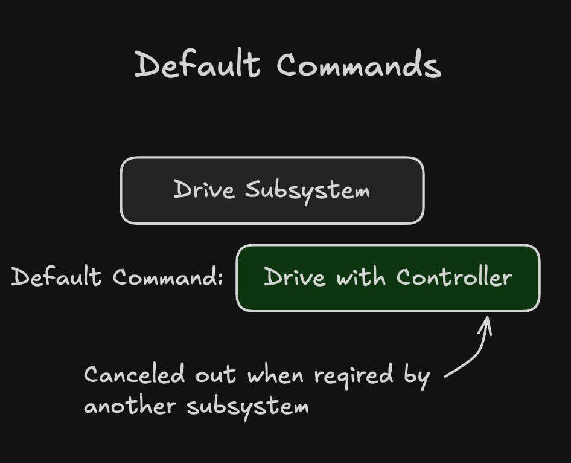

# **Command Based Programming Theory**

Command-based programming is a **design pattern** used in FRC to structure code in a modular, maintainable, and reusable way. At its core, it involves defining **commands**—single, reusable units of work—that interact with **subsystems**—the robot's mechanical and electrical components. This separation of concerns simplifies complex robotic control.

## **The Command Lifecycle**

A **Command** represents a single, autonomous task that the robot can perform. Every command follows a well-defined **lifecycle** managed by the **Command Scheduler**.

{ align=right width="300" }

### **1\. initialize()**

* Called once when the command is first scheduled.  
* Used to set up the command's initial state, such as resetting encoders, setting initial motor speeds, or preparing internal variables.

### **2\. execute()**

* Called repeatedly (typically every robot cycle, e.g., every 20ms) while the command is running.  
* Contains the main logic of the command, such as driving motors, adjusting pneumatics, or performing calculations. This method should return quickly.

### **3\. isFinished()**

* Called repeatedly to determine if the command has completed its task.  
* Returns a **boolean** value. When it returns true, the command signals the scheduler that it is finished and should be stopped. Examples include checking if a setpoint has been reached, a timer has expired, or a button has been released.

### **4\. end(boolean interrupted)**

* Called once when the command stops, either because isFinished() returned true (finished) or because it was cancelled/interrupted by another command (interrupted).
* Used to clean up, such as setting motors to zero, disabling actuators, or stopping any active sensors. The interrupted boolean can be used to perform different cleanup based on how the command ended.

## **The Command Scheduler**

The **Command Scheduler** is the *heart* of the command-based system. It acts as a central **manager** responsible for tracking, running, and terminating all active commands.

{ align=left width="300" }

### **Responsibilities**

* **Scheduling:** When a command is triggered (e.g., by a button press or another command), the scheduler places it on a list of active commands.  
* **Execution:** In the main robot loop, the scheduler iterates through all active commands and calls their respective execute() and isFinished() methods.  
* **Resource Management:** It enforces **subsystem requirements**. If a new command requires a subsystem already in use by an active command, the scheduler will automatically **interrupt** and stop the currently running command before starting the new one. This prevents conflicting control instructions.  
* **Termination:** When a command's isFinished() returns true or it's interrupted, the scheduler calls its end() method and removes it from the active list.

## **Default Commands**

A **Default Command** is a special type of command associated with a **Subsystem**.

{ align=right width="300" }

### **Behavior**

* **Always Running (Unless Interrupted):** A default command is automatically scheduled by the scheduler to run *whenever* no other command is currently running and actively requiring its associated subsystem.  
* **Low Priority:** It is the *lowest* priority command for a subsystem and will be automatically interrupted and stopped as soon as *any* other command requiring that subsystem is scheduled.  
* **Restoration:** Once the higher-priority command finishes or is interrupted, the scheduler will automatically restart the default command.

### **Common Uses**

* **Idling Behavior:** Maintaining a safe or known state, such as holding a mechanism in a specific position using a PID loop.  
* **Manual Control:** Assigning continuous joystick or controller input to a subsystem (e.g., joystick control for a drive train).