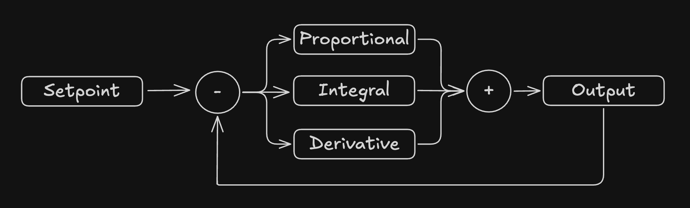
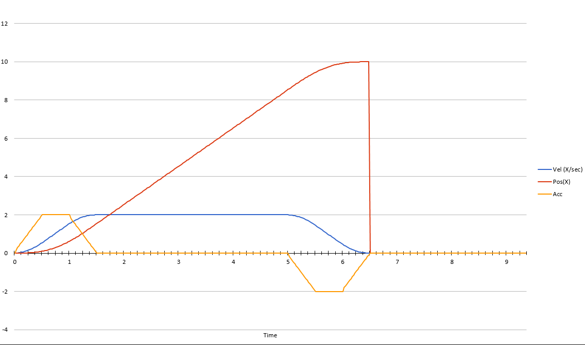

# **The Fundamentals of Controls**

So now we know how to make subsystems, create commands, and bind those commands to triggers. But how do we actually control a motor to make it do what we want to do?

Here is where control theory comes in. In this lesson we are going to cover PID and FeedForward control. These are both common types of controls that are used all over FRC. We will end the lesson by combining the two methods of control utilizing something called a trapezoidal motion profile.

## **PID**

PID is a form closed loop control. Closed loop control is where a control system activly uses feedback from motors or encoders to adjust for disturbances and noise in a system. PID is a system of control involving three gains: Proportional, Integral, and Derivative.

<figure markdown="span">
    { width="600" }
  <figcaption>A Diagram of the PID Controller System</figcaption>
</figure>
### **1. Proportional**

* This term scales linearly with the distance away from the setpoint
* It covers the majority of the output of the controller

### **2. Integral**

* This term scales linearly with the area under the curve between the setpoint and ouput
* Used for small positional errors that proportional can't overcome

### **3. Derivative**

* This term scales based on the velocity of the output
* Often not necessary for control

### **The PID Equation**
Each of these terms are combined into this equation:

$$
u\left(t\right)=K_{p}e\left(t\right)+K_{i}\int_{0}^{t}e\left(\tau\right)d\tau+K_{d}\frac{de\left(t\right)}{dt}
$$

### **Tuning**

Tuning a PID controller is a somewhat difficult process. Generally start by increasing the proportional term until the system oscilates around the setpoint. Back this term off a little. Then if the system overshoots the target increase the derivative term. If the system has a steady state error where it doesn't quite reach the target increase the integral term. Other than that its alot of trial and error to find the right values.

!!! note
    In control theory you will often see the motor or mechanism your trying to control refered to as the ```plant```.

Try to see if you can find gains that will reach the setpoint without overshooting in this PID simulator:

<div id="chartContainer" style="width:700px; height: 400px; background: #2d2d2d; border-radius: 8px; margin-bottom: 20px;">
    <canvas id="pidChart" style="width: 100%; height: 100%;"></canvas>
</div>

<div style="display: flex; flex-direction: column; align-items: center; margin-bottom: 20px;">
    <div style="margin: 10px 0; width: 300px;">
        <label for="kp" style="display: block; margin-bottom: 5px;">K (Proportional): <span id="kpValue" style="font-size: 18px; font-weight: bold; color: #ff6b6b;">0.0</span></label>
        <input type="range" id="kp" min="0" max="1" step="0.01" value="0.0" style="width: 100%; height: 8px; background: #333; outline: none; border-radius: 4px;">
        <style>
            input[type="range"]::-webkit-slider-thumb {
                -webkit-appearance: none;
                width: 20px;
                height: 20px;
                background: #ff6b6b;
                border-radius: 50%;
                cursor: pointer;
            }
        </style>
    </div>
    <div style="margin: 10px 0; width: 300px;">
        <label for="ki" style="display: block; margin-bottom: 5px;">Ki (Integral): <span id="kiValue" style="font-size: 18px; font-weight: bold; color: #ff6b6b;">0.0</span></label>
        <input type="range" id="ki" min="0" max="0.1" step="0.001" value="0.0" style="width: 100%; height: 8px; background: #333; outline: none; border-radius: 4px;">
    </div>
    <div style="margin: 10px 0; width: 300px;">
        <label for="kd" style="display: block; margin-bottom: 5px;">Kd (Derivative): <span id="kdValue" style="font-size: 18px; font-weight: bold; color: #ff6b6b;">0.0</span></label>
        <input type="range" id="kd" min="0" max="1" step="0.02" value="0.0" style="width: 100%; height: 8px; background: #333; outline: none; border-radius: 4px;">
    </div>
</div>

<script src="../../assets/pid-sim.js"></script>

## **Feed Forward**
Feed forward control is the simplest form of control. It works off of a model of the system you are trying to control. Once you have that model, you just have to move the object to the goal. Since the model depends on the type of mechanism, Wpilib supplies different kinds of physics models to base our feed forward off of.

<figure markdown="span">
    { width="600" }
  <figcaption>A Diagram of the Feed Forward Controller System</figcaption>
</figure>

### **Under the Hood**
Under the hood feed forward works of a physics model of the system. In the simplest system, without any gravity or external forces acting on a mechanism, the feed forward works of a model of a DC motor.
$$
V = K_s \cdot sgn(\dot{d}) + K_v \cdot \dot{d} + K_a \cdot \ddot{d}
$$
This is called the voltage balance equation. It defines the relationship betwen applied motor voltage, rotor velocity, rotor acceleration. It is controlled using gains that represent the systems dynamics:

| Method      | Description                          |
| ----------- | ------------------------------------ |
| `Kv`        | Voltage needed to "cruise" at a velocity  |
| `Ka`        | Voltage needed to induce a specific amount of acceleration  |
| `Ks`        | Voltage needed to overcome static friction  |
| `Kg`        | Voltage needed to overcome gravity (used in elevators and arms)  |

!!! note

    The gains for a feed forward system can be aquired in two ways. One way is to compute them using Sys-id. Sys-id involves capturing data about a mechanism and performing a regression to find the system gains. The other and more common way is to just calculate them. Using a tool like ReCalc you can calculate the theoretical values for a system based on things like motors, current limits, and dimensions.


### **Trapezoidal Motion Profiles**
Often times trapezoidal motion profiles are used alongside feed forward to have more control over system behavior. They allow us to set a desired acceleration and cruize velocity for the system to reach. This can be used to slow down a system based off limitations of the hardware. This trapezoid can be integrated to get the target position at any given time.

<figure markdown="span">
    { width="600" }
  <figcaption>A trapezoidal motion profile. Notice the shape of the position, velocity, and acceleration graphs.</figcaption>
</figure>

### **The Downside of FeedForward**
Feed forward has one major downside over PID. Unlike PID, feed forward cant react to disturbances in the system. Things like data noise, battery voltage fluctuations, and latency can cause the system to not react deterministically. However, feed forward in a deterministic world will get to the setpoint faster. This is why we need to combine the two.

## **PID + Feed Forward**
Combining PID and Feed forward allows us to get the advantages of both. Feed forward allows us to quickly get close to the setpoint, and PID allows us to combat system disturbances and accurately reach the setpoint. We can combine this with the idea of trapezoidal motion profiles as well. If we set the target of the pid and feed forward controller to be the current target of the trapezoidal profile, then we can have a lot of control over how the system will move to the setpoint.